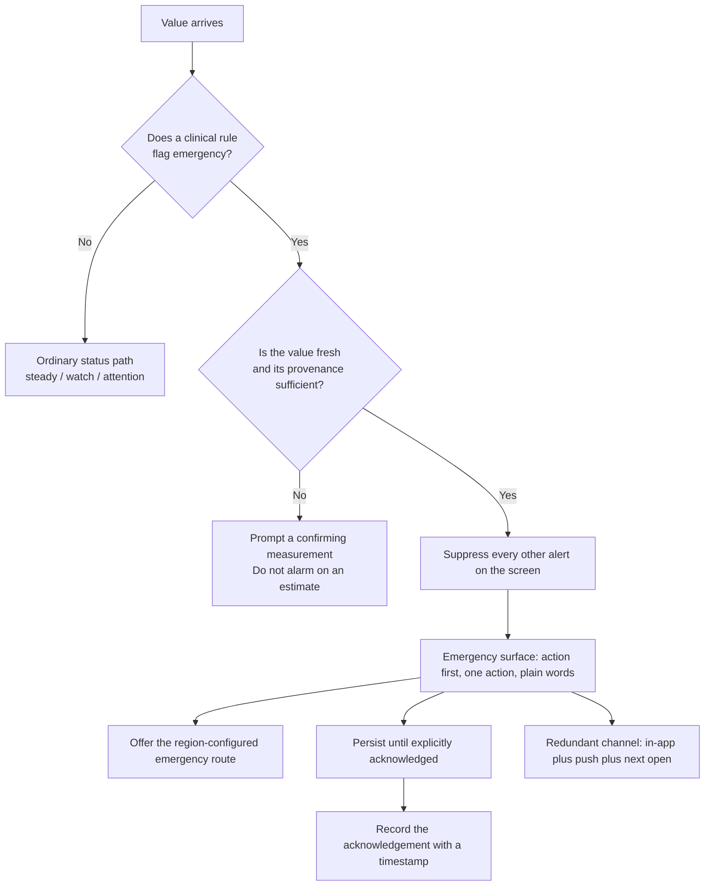

<PageTemplate kind="health" />

## What this means

An emergency path exists in a health product wherever the product's clinical
rules can flag a value, a combination of values, or an answer to a question as
meaning that a person should get help now rather than at the next convenient
moment. The flagged input may be a blood pressure reading in a range that
warrants same-day assessment, a symptom answer inside a questionnaire, or a
device alert. Which inputs carry that meaning is clinical content owned by the
adopting organisation, and what the interface does once one of them is flagged is
what this page governs.

Every other page in this documentation is written for restraint, asking that the
interface not alarm, not over-escalate and not spend attention it will need
later. This path is the single exception to every budget set by
[Alarm fatigue](./alarm-fatigue.mdx), and the requirements of the exception are
owned by this page. Engagement, brand, layout, the alert budget and the reader's
stated notification preferences are all overridden here, and the interface is
required to be unmistakable rather than calm.

Three properties of this path bear on whether it works when it fires. Its
frequency is low, so it accrues almost no exercise in production. It is
difficult to test, because reaching it requires a fixture that forces a clinical
rule to fire rather than ordinary use of the product. Its build order is late,
after the surfaces the product ships on. A defect on the ordinary status path is
measured by a product metric, and a defect here is measured by what happened to
the reader.

## The rule

**When the product's clinical rules say a value may require emergency or same-day
care, the interface enters a distinct emergency path: unmissable, unambiguous,
undismissable by accident, redundant across channels, and unaffected by every
other budget in this system.**

<FlowDiagram>

</FlowDiagram>

### The eight requirements

The order below is normative and the numbering is cited elsewhere on this page.
The last two columns record who carries each requirement while the components
remain unbuilt, and where a fuller specification exists. An empty cell means
this page is the only statement of that requirement.

| # | Requirement | What the reader must be able to do | Who implements it today | Where it is specified in full |
| --- | --- | --- | --- | --- |
| 1 | **Action first.** The first line states what to do rather than what was measured, so "Call 999 now" precedes "Your reading was 210/125". | Read the instruction before reading the number. | The product's clinical content owner, who writes the sentence. | |
| 2 | **One action.** The surface offers one primary route and no competing choice, because a second button requires the reader to decide between the two. | Act without first choosing between routes. | The product owner, who is accountable for no second route reaching the screen. | |
| 3 | **The route is configured, never hardcoded.** Emergency numbers, services and what "urgent care" means differ by country and by health system. opsinjs ships no numbers. The product configures them per region, and the interface names the service rather than assuming the reader knows which number applies. | Reach the service that covers the region they are in. | The adopting product's per-region configuration. | |
| 4 | **Everything else is suppressed.** No other banner, no other alert, no marketing, no rating prompt and no cookie notice appears beside it. The alarm-fatigue budget does not apply, because nothing else is on the screen to spend it on. | Read one surface with nothing else competing for attention. | The calling screen, because no component in the system can see a sibling. | [Alarm fatigue](./alarm-fatigue.mdx) states the exception to the budget. The suppression requirement is specified only here. |
| 5 | **It persists.** The surface does not auto-dismiss, does not time out, and survives a background and a relaunch until it is explicitly acknowledged. Acknowledgement is deliberate and is recorded with a timestamp. | Leave the app and find the surface still present on return. | The calling screen, which holds the unacknowledged state across a relaunch. | [Motion in health UI](./motion-in-health-ui.mdx) states the prohibition on auto-dismissal for anything carrying clinical meaning system-wide. Persistence across a background and a relaunch, and timestamped acknowledgement, are specified only here. |
| 6 | **It is redundant.** The message appears in-app, in a push, and in a state that is still there on next open, because any single channel may fail silently. | Receive the message on a second channel when the first fails. | The adopting product's notification integration. | [Notifications and off-screen alerts](./notifications-and-off-screen-alerts.mdx) |
| 7 | **It does not diagnose.** "This reading needs to be checked urgently" is the limit of what the interface knows, and what is wrong sits outside that limit. | Learn what to do without being told what is wrong. | The product's clinical content owner, who is accountable for wording that names no condition. | [Clinical status semantics](./clinical-status-semantics.mdx) |
| 8 | **It says what happens if the reader disagrees.** People will believe a reading is wrong and will sometimes be right, so the surface carries a route onward: re-measure, contact a service, or continue, and never a dead end. | Say that the reading looks wrong and still reach a route forward. | The product owner, who supplies the re-measurement and the non-emergency contact route. | |

**Accessibility on this surface is held to a stricter bar than the rest of the
system.** The emergency surface is announced assertively, is reachable and
operable by keyboard and by switch control, holds focus without trapping the
reader with no exit, meets the contrast floor with no material translucency, and
works at 200% text with no clipped sentence. The bar sits above the rest of the
system on this page's own reasoning, which is not a measurement opsinjs has made:
a person having a medical emergency is more likely to be using assistive settings
than a reader at any other moment.

**What must never happen:**

- An emergency conveyed by colour, motion or sound alone.
- An emergency surface behind a paywall, a login wall, or an onboarding step.
- An emergency raised from an estimated or stale value, a case the flow above
  routes to a confirming measurement instead.
- An emergency that can be swiped away by accident and never returns.
- An emergency competing with any other alert on the same screen.
- A hardcoded emergency number.

## Why (evidence)

<ResearchNote evidence="opinion" date="2026-09-02">
  **Opinion.** We cite no study anywhere on this page. There is a literature on
  emergency communication and on warning design; we have not read enough of it
  carefully enough to cite it responsibly on a page this consequential, and a
  half-remembered reference here would be worse than none.

  The design reasoning on this page rests on a single asymmetry. The emergency
  path is the surface in a health product on which the cost of
  over-communicating is bounded and the cost of under-communicating is not, so
  the trade-off between those two costs that governs every other rule in this
  documentation is suspended here rather than balanced.

  Two of the eight requirements are worth arguing about. Rule 2 restricts the
  surface to a single action, which costs flexibility, and a product might
  reasonably want to offer both "call" and "message my clinician". We prefer one
  route, on the reasoning that decision-making is impaired in exactly this
  moment. Rule 5 requires the surface to persist until acknowledgement, which is
  an unusual amount of interface authority to claim, and the alternative we
  rejected is an alert that is dismissed by a scroll gesture and never seen
  again.

  What would change our mind: a field dataset showing how readers actually
  respond to a surface that persists until acknowledged would revise rule 5, and
  a published regulator's position on single-action emergency screens would
  revise rule 2. If your product is in a regulated context, the requirements
  there outrank this page; see [Regulatory context](./regulatory-context.mdx).
</ResearchNote>

## Applying it

<DoDont>
  <DoDont.Do>
    Put the instruction first and the measurement last: "Call 999 now and say you
    have a very high blood pressure reading." Then, in smaller type: "Your
    reading was 210/125 mmHg at 08:12." The reader is given the action, the words
    to say on the call, and the evidence behind both, in that order.
  </DoDont.Do>
  <DoDont.Dont>
    Lead with the number and name the condition: "Your blood pressure is
    210/125. This is a hypertensive crisis. Seek medical attention." The surface
    asserts a diagnosis the product's clinical rules cannot support, in a
    clinical register the reader may not share, and "seek medical attention"
    names no service and no route to one.
  </DoDont.Dont>
</DoDont>

<DoDont>
  <DoDont.Do>
    Name the service for the reader's configured region, and give the alternative
    for people who cannot call: "If you cannot call, text 999 if you are
    registered, or ask someone to call for you."
  </DoDont.Do>
  <DoDont.Dont>
    Hardcode a single national number. A reader abroad, or on a different health
    system, is given a number that does not reach anyone.
  </DoDont.Dont>
</DoDont>

<DoDont>
  <DoDont.Do>
    Offer "I do not think this reading is right" as a secondary route, and lead
    it to re-measurement instructions and a non-emergency contact option.
  </DoDont.Do>
  <DoDont.Dont>
    Offer only "Call now" and "Dismiss". A reader who is certain the cuff slipped
    takes the dismissal, because it is the only alternative on the surface, and
    the product records no reason and leaves that reader no route back in.
  </DoDont.Dont>
</DoDont>

<DoDont>
  <DoDont.Do>
    Test this path in every release the way you test payment: with a fixture that
    forces it, on a real device, at 200% text, with a screen reader, offline.
  </DoDont.Do>
  <DoDont.Dont>
    Ship it untested because it is rare. The first execution of the path then
    happens on a reader's device, in the one situation in which a clipped
    sentence, a missing announcement or an unreachable button cannot be recovered
    from afterwards.
  </DoDont.Dont>
</DoDont>

## Components that implement this

{/* Generated from `implements`. Do not restate the list by hand. */}

The emergency surface is specified as a distinct configuration of `AlertBanner`
and `CareCard` rather than as a separate component, so that it inherits the same
announcement and contrast contract as every other alert and does not drift into a
bespoke screen that no audit covers. That specification includes its suppression
behaviour, which hides every other alert on the screen. What ships today falls
short of that in one specific respect. Both components are at `alpha`, and
neither can see a sibling, let alone silence one, so rule 4 is the caller's to
implement and the caller's to test on every screen that can reach this path. Rule
4 therefore belongs in product code with a named owner rather than in an
assumption that a component is holding it.

## What this does not cover

- **Which values are emergencies.** Every threshold on this path is clinical
  content owned by your organisation, and it should be reviewed by someone
  clinically accountable, written down, and version controlled.
- **Emergency service integration**, dispatch, or anything that contacts a
  service on the reader's behalf. That is a substantial regulatory undertaking
  and sits outside a presentation layer.
- **Mental health crisis**, which needs a different tone and different routes:
  [Crisis and self-harm](./crisis-and-self-harm.mdx).
- **Clinical escalation between professionals**, which is not a consumer surface.
- **Legal duties.** Whether the adopting organisation has a duty to act on a
  flagged value is a question for its clinical safety and legal teams.

<Todo>Specify the suppression mechanism rule 4 asks for: what a screen calls to
enter the emergency state, what happens to an alert that has already been
announced, and how the state is unwound on acknowledgement. Rule 4 is the only
requirement on this page whose behaviour depends on what else is on the screen,
and no component in the system can inspect its siblings.</Todo>

## Updates to this page

<Reviewed />
