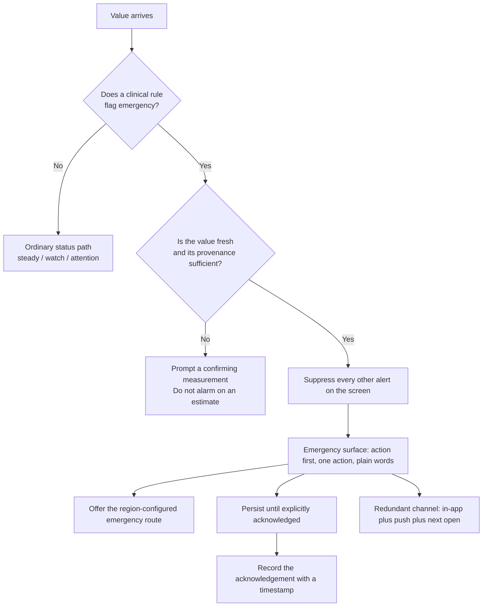

<PageTemplate kind="health" />

## What this means

Somewhere in a health product there is a value, or a combination of values, or an
answer to a question, that means a person should get help now rather than at the
next convenient moment. It might be a blood pressure reading in a range that
warrants same-day assessment. It might be a symptom answer inside a
questionnaire. It might be a device alert.

Everything else in this documentation is about restraint: do not alarm, do not
over-escalate, do not spend attention you will need later. This page is the
opposite. It is the one place where the interface stops being calm and starts
being unmistakable, and where every competing consideration — engagement, brand,
layout, the alert budget, the reader's preferences — loses.

The design problem is that this path fires rarely, is difficult to test, and is
usually built last. It is the least-exercised code in the product and the only
part where a failure is measured in outcomes rather than in metrics.

## The rule

**When the product's clinical rules say a value may require emergency or same-day
care, the interface enters a distinct emergency path: unmissable, unambiguous,
undismissable by accident, redundant across channels, and unaffected by every
other budget in this system.**

<FlowDiagram>

</FlowDiagram>

**The eight requirements:**

1. **Action first.** The first line is what to do, not what was measured.
   "Call 999 now" before "Your reading was 210/125".
2. **One action.** An emergency surface offers one primary route and no
   competing choices. A second button is a decision, and a person in this
   situation should not be making one.
3. **The route is configured, never hardcoded.** Emergency numbers, services and
   what "urgent care" means differ by country and by health system. opsinjs ships
   no numbers. Your product configures them per region, and the interface names
   the service rather than assuming the reader knows which number applies.
4. **Everything else is suppressed.** No other banner, no other alert, no
   marketing, no rating prompt, no cookie notice. The alarm-fatigue budget does
   not apply because there is nothing else on the screen.
5. **It persists.** The surface does not auto-dismiss, does not time out, and
   survives a background and a relaunch until it is explicitly acknowledged.
   Acknowledgement is deliberate and recorded with a timestamp.
6. **It is redundant.** In-app, plus a push, plus a state that is still there on
   next open. Any single channel may fail silently; see
   [Notifications and off-screen alerts](./notifications-and-off-screen-alerts.mdx).
7. **It does not diagnose.** "This reading needs to be checked urgently" is what
   the interface knows. What is wrong is not.
8. **It says what happens if the reader disagrees.** People will believe a
   reading is wrong, and sometimes they are right. Give a route: re-measure,
   contact a service, or continue — never a dead end.

**Accessibility is not relaxed here, it is tightened.** The emergency surface is
announced assertively, is reachable and operable by keyboard and by switch
control, holds focus without trapping the reader with no exit, meets the contrast
floor with no material translucency, and works at 200% text with no clipped
sentence. A person having a medical emergency is more likely to be using
assistive settings, not less.

**What must never happen:**

- An emergency conveyed by colour, motion or sound alone.
- An emergency surface behind a paywall, a login wall, or an onboarding step.
- An emergency raised from an estimated or stale value — see rule and flow above.
- An emergency that can be swiped away by accident and never returns.
- An emergency competing with any other alert on the same screen.
- A hardcoded emergency number.

## Why (evidence)

<ResearchNote evidence="opinion" date="2026-09-02">
  Opinion, and we cite nothing. There is a literature on emergency
  communication and on warning design; we have not read enough of it carefully
  enough to cite it responsibly on a page this consequential, and a
  half-remembered reference here would be worse than none.

  The design reasoning is straightforward. The emergency path is the only surface
  in a health product where the cost of over-communicating is small and the cost
  of under-communicating is unbounded. Every other rule in this documentation
  trades those two costs against each other. Here we stop trading.

  Two choices are worth arguing about. Rule 2 — one action only — costs
  flexibility, and a product might reasonably want to offer both "call" and
  "message my clinician". We prefer one, on the reasoning that decision-making is
  impaired in exactly this moment. Rule 5 — persistence until acknowledgement —
  is an unusual amount of interface authority to claim, and the alternative is
  an alert that is dismissed by a scroll gesture and never seen again.

  What would change our mind: field evidence on acknowledgement behaviour, or a
  regulator's view. If your product is in a regulated context, the requirements
  there outrank this page; see [Regulatory context](./regulatory-context.mdx).
</ResearchNote>

## Applying it

<DoDont>
  <DoDont.Do>
    "Call 999 now and say you have a very high blood pressure reading." Then, in
    smaller type: "Your reading was 210/125 mmHg at 08:12." Action, script,
    evidence.
  </DoDont.Do>
  <DoDont.Dont>
    "Your blood pressure is 210/125. This is a hypertensive crisis. Seek medical
    attention." A diagnosis the app has not earned, in clinical register, with a
    vague instruction and no route.
  </DoDont.Dont>
</DoDont>

<DoDont>
  <DoDont.Do>
    Name the service for the reader's configured region, and give the alternative
    for people who cannot call: "If you cannot call, text 999 if you are
    registered, or ask someone to call for you."
  </DoDont.Do>
  <DoDont.Dont>
    Hardcode a single national number. A reader abroad, or on a different health
    system, is given a number that does not reach anyone.
  </DoDont.Dont>
</DoDont>

<DoDont>
  <DoDont.Do>
    "I do not think this reading is right" as a secondary route that leads to
    re-measurement instructions and a non-emergency contact option.
  </DoDont.Do>
  <DoDont.Dont>
    Offer only "Call now" and "Dismiss". A reader who is certain the cuff
    slipped will dismiss, and the app has learnt nothing and offered nothing.
  </DoDont.Dont>
</DoDont>

<DoDont>
  <DoDont.Do>
    Test this path in every release the way you test payment: with a fixture that
    forces it, on a real device, at 200% text, with a screen reader, offline.
  </DoDont.Do>
  <DoDont.Dont>
    Ship it untested because it is rare. Rare and consequential is the definition
    of the code that must be tested most.
  </DoDont.Dont>
</DoDont>

## Components that implement this

{/* Generated from `implements`. Do not restate the list by hand. */}

The emergency surface is specified as a distinct configuration of `AlertBanner`
and `CareCard` rather than a separate component, so that it inherits the same
announcement and contrast contract as every other alert and cannot drift into
being a bespoke screen nobody audits. Its suppression behaviour — hiding every
other alert on the screen — is part of the specification, not a caller's
responsibility.

## What this does not cover

- **Which values are emergencies.** Every threshold on this path is clinical
  content owned by your organisation, and it should be reviewed by someone
  clinically accountable, written down, and version controlled.
- **Emergency service integration**, dispatch, or anything that contacts a
  service on the user's behalf. That is a substantial regulatory undertaking.
- **Mental health crisis**, which needs a different tone and different routes:
  [Crisis and self-harm](./crisis-and-self-harm.mdx).
- **Clinical escalation between professionals**, which is not a consumer surface.
- **Legal duties.** Whether you have a duty to act on a flagged value is a
  question for your clinical safety and legal teams.

## Updates to this page

<Reviewed />
